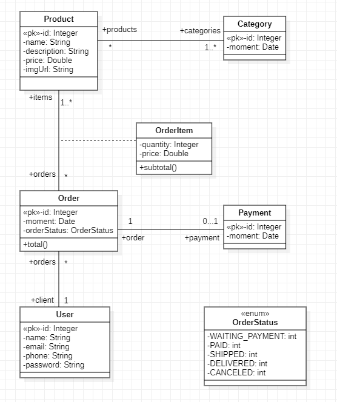

## BackEnd Java utilizando as tecnologias:
* Spring Boot
* Orientado à Objetos
* JPA - Hibernate
* PostGreeSQL
* HTML5
* CSS3

### FrontEnd (em produção) 
[Link da aplicação](https://spring-test-home.herokuapp.com/) 

### Modelagem de dados - Diagrama de Classes
